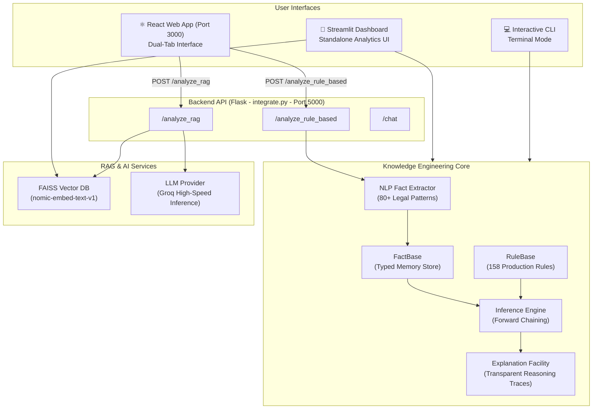

# ⚖️ IPC Legal Research Assistant

[](https://www.python.org/downloads/)
[](https://reactjs.org/)
[](https://flask.palletsprojects.com/)
[](https://streamlit.io/)
[](https://github.com/facebookresearch/faiss)
[](https://groq.com/)
[](https://opensource.org/licenses/MIT)

> An intelligent, dual-engine legal research platform designed to analyze natural language case facts and accurately identify applicable sections of the **Indian Penal Code (IPC)**. It combines a deterministic **Rule-Based Expert System** with a generative **Retrieval-Augmented Generation (RAG)** pipeline powered by **Groq**.

---

## 📑 Table of Contents

- [Overview](#-overview)
- [System Architecture](#-system-architecture)
- [Key Features](#-key-features)
- [How It Works](#-how-it-works)
  - [1. Rule-Based Expert System](#1-rule-based-expert-system-deterministic)
  - [2. RAG Conversational AI](#2-rag-conversational-ai-generative)
  - [3. Intelligent Fallback UX](#3-intelligent-fallback-ux)
- [Project Structure](#-project-structure)
- [Prerequisites](#-prerequisites)
- [Installation & Setup](#-installation--setup)
- [Running the Application](#-running-the-application)
- [API Reference](#-api-reference)
- [Benchmarking & Evaluation](#-benchmarking--evaluation)
- [License](#-license)

---

## 🌟 Overview

Legal research in criminal law demands high precision and transparency. Traditional keyword search misses semantic nuances, while standalone generative LLMs can hallucinate sections or fabricate legal precedents.

The **IPC Legal Research Assistant** addresses these challenges via a hybrid paradigm:
1. **Primary Deterministic Engine (Expert System)**: Evaluates case descriptions through NLP fact extraction and a forward-chaining rule engine across **158 formal IPC section rules**. Offers Explainable AI (XAI) traces with matched facts and missing conditions.
2. **Secondary Generative Engine (RAG AI)**: Leverages FAISS vector search (`nomic-embed-text-v1`) on official IPC law documents combined with ultra-fast LLM inference via **Groq** for conversational Q&A.
3. **Intelligent Fallback**: If the rule base finds only partial matches due to ambiguous or missing facts, the UI transparently alerts the user and enables one-click escalation to the RAG engine inline.

---

## 🏛️ System Architecture



---

## ✨ Key Features

- **158 Formalized IPC Rules**: Structured production rules covering offenses against the human body, property, public tranquility, marriage, defamation, and criminal conspiracy.
- **Rule Chaining & Derived Facts**: Models legal dependencies (e.g., establishing Section 300 Murder derives facts triggering Section 302 Punishment; Section 120A triggers Section 120B).
- **Conflict Resolution by Specificity**: Prioritizes more specific legal charges (e.g., Section 326A Acid Attack with Grievous Hurt ranked higher than general hurt).
- **Transparent Reasoning Traces**: Displays exact condition audits: which facts were detected, which conditions matched, and what elements were missing.
- **Semantic Vector Retrieval**: 1024-dimension chunk embeddings of statutory IPC text indexed via FAISS.
- **Multi-Turn Conversational Memory**: Chat interface maintains dialogue history for contextual follow-up questions.
- **Multiple Frontends**: Includes a modern React 18 frontend and a lightweight Streamlit dashboard.

---

## 🔍 How It Works

### 1. Rule-Based Expert System (Deterministic)
1. **Fact Extraction**: User input is parsed against legal concept trigger patterns (80+ concepts, including `caused_death`, `grievous_hurt`, `negligence`, `dishonest_intention`, `public_servant`, etc.).
2. **Forward Chaining Loop**: Evaluates preconditions and exceptions across all rules, asserting derived facts until fixed-point convergence.
3. **Explanation Generation**: Audits each fired or partially satisfied rule into readable audit trails.

### 2. RAG Conversational AI (Generative)
1. **Retrieval**: User case descriptions are embedded with `nomic-embed-text-v1` and matched against the local FAISS index (`ipc_vector_db`).
2. **Context Augmentation**: Top-$k$ legal text segments are formatted into an instruction-tuned prompt.
3. **Generation**: Groq generates structured legal findings with statutory explanations using available models (auto-detected or configurable via `GROQ_MODEL`).

### 3. Intelligent Fallback UX

| Scenario | System Output | User Action |
|---|---|---|
| **Exact Match** | High-confidence green card(s) with full statutory descriptions and explanation audit | Review sections and punishments |
| **Partial Match** | Yellow warning banner highlighting matched vs. missing elements | One-click button to escalate query to RAG AI inline |
| **No Match** | Red alert indicating absence of recognized IPC offense criteria | Rephrase case or switch to conversational chat |

---

## 📂 Project Structure

```text
.
├── Frontend/                           # React 18 User Interface
│   ├── public/                         # Static assets and index.html
│   ├── src/
│   │   ├── Home.js                     # Main dual-tab interface & fallback logic
│   │   ├── Home.css                    # UI styles & responsive layout
│   │   └── index.js                    # React entry point
│   └── package.json                    # Node dependencies
├── knowledge_engineering/              # Core Expert System modules
│   ├── api.py                          # Dedicated Flask REST API for expert system
│   ├── comprehensive_ipc_rules.json    # Knowledge base containing 158 IPC rules
│   ├── explanation.py                  # Explanation facility & audit logs
│   ├── fact_base.py                    # Typed working memory store
│   ├── hybrid_system.py                # Hybrid pipeline orchestrator & CLI
│   ├── inference_engine.py             # Forward-chaining inference engine
│   ├── rag_module.py                   # FAISS retrieval integration
│   ├── requirements.txt                # Submodule dependencies
│   └── tests/                          # Test suite (pytest)
├── ipc_vector_db/                      # Pre-compiled FAISS vector database
│   ├── index.faiss                     # Vector indices
│   └── index.pkl                       # Pickled docstore and metadata
├── app.py                              # Standalone Streamlit dashboard
├── integrate.py                        # Unified Flask backend API
├── rebuild_faiss_db.py                 # Vector DB compilation utility
├── benchmark.py                        # Accuracy and performance benchmarking
├── generate_charts.py                  # Evaluation visualization generator
├── requirements.txt                    # Project Python dependencies
├── requirements.text                   # Mirror requirements specification
├── .env.example                        # Template for API credentials
└── README.md                           # Project documentation
```

---

## ⚙️ Prerequisites

- **Python**: Version 3.10 or higher
- **Node.js**: Version 18 or higher (for the React frontend)
- **API Key**: A free [Groq API Key](https://console.groq.com/keys) (Required for RAG Conversational AI)

---

## 🚀 Installation & Setup

### 1. Clone the Repository
```bash
git clone https://github.com/darksinnnn/Legal-Advisor.git
cd Legal-Advisor
```

### 2. Python Environment Setup
```bash
# Create and activate virtual environment
python -m venv venv

# On Windows:
venv\Scripts\activate

# On Linux / macOS:
source venv/bin/activate

# Install dependencies
pip install -r requirements.txt
```

### 3. Environment Configuration
Copy the template configuration and supply your API keys:
```bash
cp .env.example .env
```
Open `.env` and set your credentials:
```env
GROQ_API_KEY=gsk_your_groq_api_key_here
PORT=5000
```

### 4. Frontend Setup (React)
```bash
cd Frontend
npm install
cd ..
```

---

## 🖥️ Running the Application

### Option 1: Full-Stack Web App (Recommended)

Start the Flask backend and React frontend concurrently:

1. **Start Backend**:
   ```bash
   python integrate.py
   ```
   *Runs on `http://127.0.0.1:5000`*

2. **Start Frontend**:
   ```bash
   cd Frontend
   npm start
   ```
   *Opens in your browser at `http://localhost:3000`*

---

### Option 2: Standalone Streamlit Dashboard

For rapid local testing and visual legal exploration:
```bash
streamlit run app.py
```
*Opens at `http://localhost:8501`*

---

### Option 3: Terminal CLI Mode

Run the interactive command-line interface:
```bash
# Interactive case input prompt
python knowledge_engineering/hybrid_system.py

# Or run automated demo test suite
python knowledge_engineering/hybrid_system.py --demo
```

---

## 📡 API Reference

Unified Flask Server (`integrate.py` on port 5000):

### 1. Deterministic Rule-Based Analysis
- **Endpoint**: `POST /analyze_rule_based`
- **Payload**:
  ```json
  {
    "message": "A group entered my house at night with weapons and stole jewelry."
  }
  ```
- **Response**:
  ```json
  {
    "success": true,
    "matched_sections": [
      {
        "section_id": "395",
        "description": "Punishment for dacoity",
        "specificity": 3
      }
    ],
    "partial_matches": [],
    "explanations": ["..."],
    "warnings": []
  }
  ```

### 2. RAG Generative Analysis / Fallback
- **Endpoint**: `POST /analyze_rag`
- **Payload**:
  ```json
  {
    "message": "What are the legal implications of forging a signature on property documents?",
    "history": []
  }
  ```
- **Response**:
  ```json
  {
    "success": true,
    "message": "Relevant sections include IPC Section 463 (Forgery) and Section 465 (Punishment for forgery)..."
  }
  ```

---

## 📊 Benchmarking & Evaluation

To evaluate model accuracy and run automated regression tests across standard legal scenarios:

```bash
# Run benchmark suite
python benchmark.py

# Generate comparison visual charts
python generate_charts.py
```

Results and metric visualizations are saved to `benchmark_results.json` and the `report/` directory.

---

## 📄 License

This project is licensed under the MIT License. See the [LICENSE](LICENSE) file for details.
